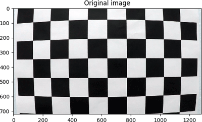
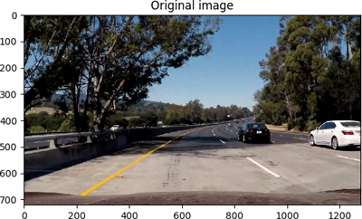
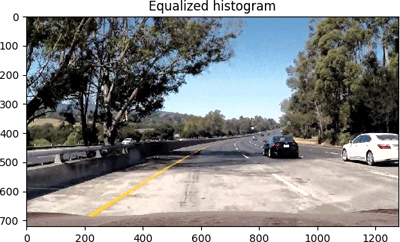
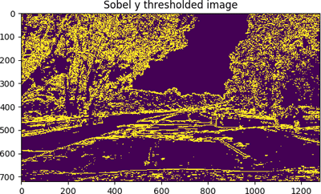
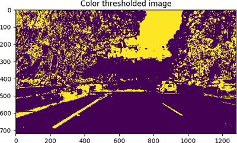
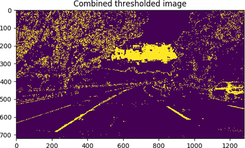
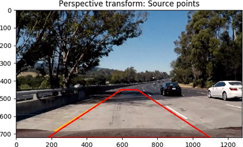
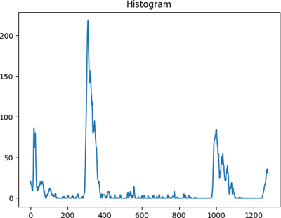
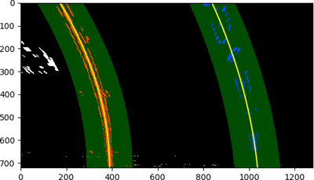
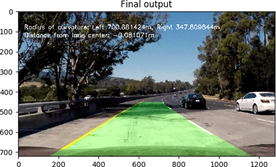

# Advanced Lane Finding Project Report

## The goals / steps of this project are the following:

- Compute the camera calibration matrix and distortion coefficients given a set of chessboard images.
- Apply a distortion correction to images.
- Use color transforms, gradients, etc., to create a thresholded binary image.
- Apply a perspective transform to rectify binary image (&quot;birds-eye view&quot;).
- Detect lane pixels and fit to find the lane boundary.
- Determine the curvature of the lane and vehicle position with respect to center.
- Warp the detected lane boundaries back onto the original image.
- Output visual display of the lane boundaries and numerical estimation of lane curvature and vehicle
- position.

This project is graded according to the criteria in the [project rubric](https://review.udacity.com/#!/rubrics/571/view).

## Project files

The project includes the following files:

- **AdvancedLaneFinding.py** holds the main program logic
- **CameraCalibration.py** contains camera calibration / distortion correction support functions
- **Preprocessing.py** contains image pre-processing support functions
- **LaneAnalysis.py** contains the analysis support functions to find / fit the lanes
- **project\_video.mp4** is a video identifying the lanes, distance from center, and curvature radii
- **writeup\_report.pdf** is a report summarizing the project results

### Running the program

To run the main program (which processes and builds the project video), you can run:

**python AdvancedLaneFinding.py**

### Testing support functions

The support functions can also be tested by running:

- **python CameraCalibration.py**
- **python Preprocessing.py**
- **python LaneAnalysis.py**

## Camera Calibration

### Calibration overview

The calibration process is as follows:

- Print out a chessboard pattern and count the number of black-white corners (in this case, we&#39;re using a 10x7 pattern, so there are **9x6 corners** )
- Use the camera you want to calibrate, and take some pictures of this pattern from different angles
- Use OpenCV&#39;s **findChessboardCorners()** function to figure out where the corners **currently are**
- Create an array specifying where you think the corners **should be**

| 
 |  |
| --- | --- |

## Pre-processing (Before lane identification)

### Pre-processing overview

The main objective of pre-processing is to make the lane lines as obvious and as easy to detect as possible, even under different lighting conditions. Here are the pre-processing steps I used, starting with the original image:

### Histogram Equalization

I performed histogram equalization by converting the image from **RGB** to **YUV** (where the **Y channel** contains **black and white** information, while U and V channels contain color). The Y channel is then fed into the **cv2.equalizeHist()** function the same way you would a grayscale image. The image is then converted back to RGB. The output of this operation looks like this:

### Extracting the S channel from the HSL color space

The Saturation channel (S) of the HSL color space is a good way to highlight the lane lines even the lines seem very faint to the human eye. This is done by converting the image to the HSL color space (using **cv2.cvtColor(cv2.RGB2HLS)**).

### Sobel Filter in the X direction

I applied a Sobel filter on a grayscaled version of the image, using the **cv2.Sobel()** function in the **x direction**. The sobel filter works by convolving the **Sobel operator/kernel** across the image. The Sobel operator is just a fancy name for a matrix where, when used in the X direction, the rows have positive and negative values on the sides, zero in the middle, and the total sums to zero. E.g. **[[+1, 0, -1], [+2, 0, -2], [+1, 0, -1]]**. When used in the Y direction, the columns sum to zero instead. Running this across the image has an effect of highlighting the edges.

As an additional step, the results are thresholded so they only show up as a &#39;1&#39; in the image if they fall between a certain value.

### Sobel Filter in the Y direction

The same filter and threshold is applied in the Y direction

### Gradient Magnitude

Since the Sobel X and Sobel Y filters highlight the changes and approximate the derivative in their respective directions, we could combine them and take it one step further by calculating the gradient magnitude. The same way we would calculate the hypotenuse of a right triangle if we only had the length of the other two sides. This produces the following results:

### Color Threshold

Besides detecting edges, we can also use the color information and output a 1 if the values fall within a certain threshold. For the purposes of this project, this operation is done **twice**. Once on the S channel of the original image, and another time on the S channel of the image with its histogram equalized. I noticed that AND-ing the two results made the detection more resistant to sudden patches of dark shadows in the image.

### Combined Threshold

Finally, I combine the results of the previous steps into a combined, thresholded image. The combination is mixed in the following way:

**(Sobel\_X &amp; Sobel\_Y &amp; Gradient\_magnitude) | (Color\_threshold &amp; Equalized\_histogram\_color\_threshold)**

The resulting image highlights the lane lines well enough for analysis.

### Perspective Transform for Lane Analysis

Once the lane lines are highlighted, I do a perspective transform of the image to a top-down/birds eye view for further analysis. The code that does this is in the **get\_transform\_matrices()** and **transform\_perspective()** functions in the **Preprocessing.py** module. This is achieved by specifying two sets of points on the image: 4x source points, and 4x destination points. The OpenCV function **getPerspectiveTransform()** will produce a transformation matrix that transforms the image so that the source points meet the destination points. Once you have the transformation matrix, you can apply it to the image using **cv2.warpPerspective()**.

## Lane Analysis

### Lane Analysis Overview

The goals of lane analysis step are to:

- Identify the **left** and **right** lane lines
- Calculate the **curvature** of the road
- Determine how far the car is **from the center** of the road

Lane analysis begins with the following image:

### Identifying starting points

The methods of analysis described in the lectures seem to work well. I will describe them here. A quick and dirty way to get a first approximation of where the lanes are is to take a histogram of the **bottom half** of the image, and look at where the peaks are. (Half seemed to work best. Taking more than that seemed to produce worse results)

There will be cases where this won&#39;t work well (e.g. dotted line happens to be in top half of image), but those can be compensated for with higher level sanity checking.

### Progressively searching for lane &#39;pixels&#39;

Starting from the two initial points, we apply sliding widows and steadily progress upwards while capturing pixels within the window (to be averaged later). If we encounter a particularly dense blob of pixels, there&#39;s a good chance that it&#39;s a lane line, and we use the average X position of those pixels as the center of our next window.

Once we&#39;ve captured all the lane related pixels, we fit a polynomial through them using numpy&#39;s **polyfit()** function. Since we&#39;re only looking about 30 meters ahead, it&#39;s reasonable to only expect a single curve in the road so we fit the pixels using a **second order polynomial**.

**Improving the search for subsequent frames**

Once the initial polynomial has been fitted, we can save a bit of computation by not having to figure out the starting points and do the whole sliding window thing again. Instead, we just search in the area **around the polynomial identified in the previous frame** (since we expect lane lines to **gradually change** , at least for now).

### Highlighting the identified lanes

Once we have identified the lanes, we can highlight them in the original image by:

- Drawing the polynomials onto an overlay image while still in Birds Eye View
- Perform a perspective transform back to the Car&#39;s view (using the inverse matrix we calculated earlier)
- Blending the transformed overlay with the original image

### Calculating road curvature

Once we have identified our lane lines (represented as polynomials), we can perform some additional calculations. One of them is **road curvature**. Road curvature is represented by a **curvature radius** (like fitting a circle on the curve. The smaller the circle radius, the sharper the turn).

While the lecture materials included a link with a mathematical derivation of curvature and the curvature radius, I found [this short lesson series from the Khan Academy](https://www.khanacademy.org/math/multivariable-calculus/multivariable-derivatives/curvature/v/curvature-intuition) to be **a lot more useful** for building up intuition on curvature and why the formula for curvature radius looks the way it does.

We can use the calculated road curvature to figure out how sharp the turn is, and as a sanity check to make sure the curvatures of the detected lines are roughly within the same order of magnitude (such sanity checks have not been implemented at this point).

### Calculating distance from center

We can also figure out the center point of the lane by finding the point between our two polynomials (taken at the bottom of the image). Then, assuming the camera is centered on the car, we can calculate how far off the car is from the center of the road.

### Pixel to Meters conversion

Assumptions had to be made to arrive at the right values for pixel-to-meters conversion. It assumes that the road follows the minimum allowed lane width of **3.7 meters** , and that we&#39;re looking ahead **30 meters** when doing a perspective transform of the road for lane analysis. So our pixel to meters scale factor would be:

- 3.7 meters divided by the &#39;detected pixel width of the lane&#39;
- 30 meters divided by the &#39;pixel length of 30m of road in Birds Eye View&#39;, which is just our image height

### Thoughts and Observations

This method, while a lot more robust, still assumes that the road is reasonably consistent, so scenarios like T-junctions, intersections and dead ends would require a different approach. Nevertheless, the general approach to solving the problem (transforming to birds eye view for analysis, fitting polynomials to make calculation easier) is useful.
